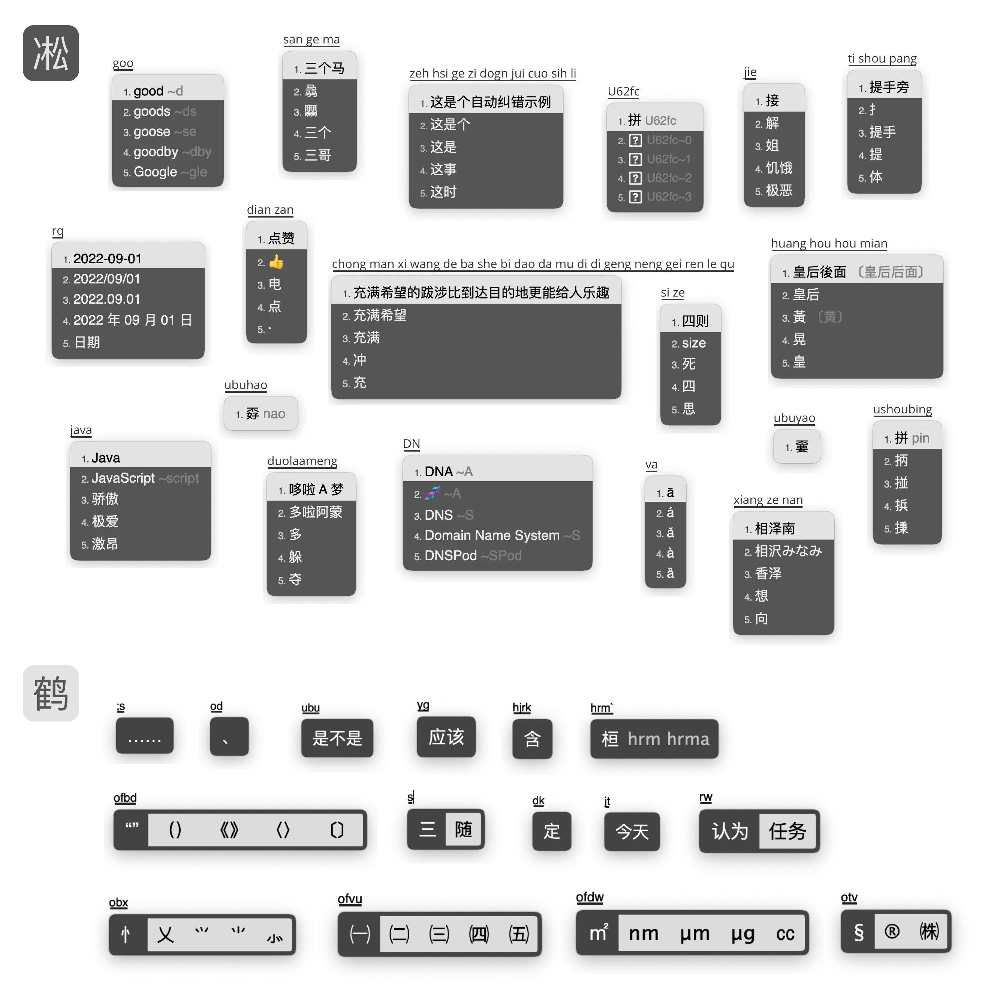

# 凇鹤拼音



整合了雾凇拼音和小鹤双拼/音形方案的拼音输入法，简称「凇鹤拼音」。

- 雾凇：功能齐全，词库体验良好，长期更新修订。
- 凇鹤：去除了雾凇中的其他双拼方案，增加了对鹤形的支持，对接官方的小鹤音形。

[Rime 配置：雾凇拼音 | 长期维护的简体词库](https://github.com/iDvel/rime-ice) 是本方案全拼/双拼部分的基础方案和词库方案。

[小鹤双拼/音形](https://www.flypy.com/) 是以双手均衡性最优、强弱指分布最合理、跨排别扭组合频率最低为追求的双拼设计方案。其音形码以易学、单字重码率适度、整体效率持平四码类方案为设计目的。

[RIME | 中州韵输入法引擎](https://rime.im/) 是一个跨平台的输入法算法框架，这里是 Rime 的一个配置仓库。

用户需要[下载各平台对应的 Rime 发行版](https://rime.im/download/)，并将此配置应用到配置目录。

详细介绍：[Rime 配置：雾凇拼音](https://dvel.me/posts/rime-ice/)


## 基本套路

- 简体 | 全拼 | 小鹤双拼 | 小鹤音形
- [雾凇部分全部功能](https://github.com/iDvel/rime-ice#%E5%9F%BA%E6%9C%AC%E5%A5%97%E8%B7%AF)
- 凇鹤 - 小鹤音形主要功能
    - 符号
    - 分号次选
    - o 符号引导
    - 一简、二简，次选词库
    - 全码
    - 二简提示
    - ` 万能码
    - 部件和特殊符号

## 长期维护词库

- 小鹤音形的主码表
- 「置顶词库」码表：默认会置顶全码词
- 「简辅库」码表
- 「用户词库」码表：全码词和二简提示
- 「全码字库」码表

## 使用说明

建议备份原先配置，清空配置目录。

### 手动安装

将仓库所有文件复制粘贴进去就好了。

更新词库，手动覆盖 `cn_dicts` `en_dcits` `opencc` `build` 四个文件夹。

### 软链接安装（推荐）

克隆本仓库到本地（不要删除）。进入仓库目录，将本地目录创建软链接到 Rime 的配置目录：

```
rm -rf ~/Library/Rime && ln -s . ~/Library/Rime
```

这样的好处是，更新时只需要回到仓库目录运行 `git pull` 即可。
