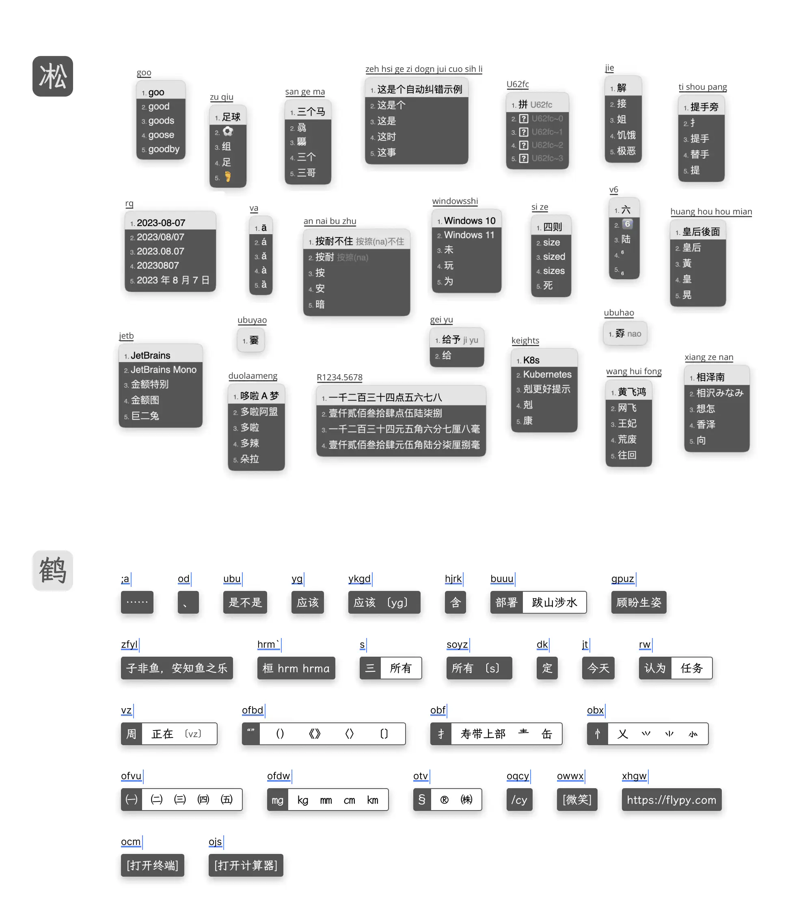
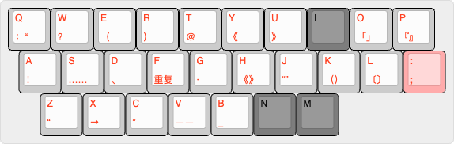

# 凇鹤拼音



整合了雾凇拼音和小鹤双拼/音形方案的拼音输入法，简称「凇鹤拼音」。

- 雾凇：功能齐全，词库体验良好，长期更新修订。
- 凇鹤：去除了雾凇中的其他双拼方案，增加了对鹤形的支持，对接官方的小鹤音形。
- tiger-code 分支中现可使用虎码了。

[Rime 配置：雾凇拼音 | 长期维护的简体词库](https://github.com/iDvel/rime-ice) 是本方案全拼/双拼部分的基础方案和词库方案。

[小鹤双拼/音形](https://www.flypy.com/) 是以双手均衡性最优、强弱指分布最合理、跨排别扭组合频率最低为追求的双拼设计方案。其音形码以易学、单字重码率适度、整体效率持平四码类方案为设计目的。

[RIME | 中州韵输入法引擎](https://rime.im/) 是一个跨平台的输入法算法框架，这里是 Rime 的一个配置仓库。

用户需要[下载各平台对应的 Rime 发行版](https://rime.im/download/)，并将此配置应用到配置目录。

详细介绍：[Rime 配置：雾凇拼音](https://dvel.me/posts/rime-ice/)


## 基本套路

- 简体 | 全拼 | 小鹤双拼 | 小鹤音形
- [雾凇部分全部功能](https://github.com/iDvel/rime-ice#%E5%9F%BA%E6%9C%AC%E5%A5%97%E8%B7%AF)
- 凇鹤 - 小鹤音形主要功能：
    - 首选词（必选）
    - 通过分号次选字词上屏
    - 随心码调整特殊的码位
    - 分号键引导的快符（不支持成对符号光标移动到中间）
    - 一简词
    - 表外字，主要是粤语词汇
    - 全码词
    - `O` 符号引导（默认关闭）
    - 全码字（默认关闭，出简不全）
    - 用户码表
    - 简码提示，如熟悉可以关闭
    - 二重简码（默认关闭，10.9k 之后由一简词代替，可以根据情况开关）
    - 左 `Shift` 键用做输入法内的〔中/英〕切换，右 `Shift` 键保留系统（可通过 Karabiner 等工具实现输入法切换）
    - \` 万能码，作为任意码的补全
    - 通过 Lua 脚本实现了部分直通车功能
    - `Tab` 键编码清屏
    - `Enter` 键编码上屏
    - `Shift + 空格` 进行〔中/半角〕切换
    - `Ctrl + .` 进行〔中/英标点〕切换
    - `Ctrl + j` 进行〔简/繁〕切换

### 支持的快符



<!--
http://www.keyboard-layout-editor.com/#/
[{t:"#ff0000"},"Q\n：“","W\n？","E\n（","R\n）","T\n@","Y\n《","U\n》",{c:"#7d7d7d",t:"#000000"},"I",{c:"#cccccc",t:"#ff0000"},"O\n「」","P\n『』"],
[{x:0.25},"A\n！","S\n……","D\n、","F\n重复","G\n·","H\n《》","J\n“”","K\n（）","L\n〔〕",{c:"#ffabab"},":\n;"],
[{x:0.75,c:"#cccccc"},"Z\n“","X\n→","C\n”","V\n——","B\n_",{c:"#7d7d7d",t:"#000000"},"N","M"]
 -->

### 支持的直通车功能

|编码|Windows功能|macOS功能|
|-|-|-|
|oav|打开安装目录|打开安装目录|
|ocm|打开CMD|打开Terminal|
|odn|打开我的电脑|打开Finder|
|oec|打开Excel|打开Excel|
|ogj|打开用户配置目录|打开用户配置目录|
|oht|打开画图工具|-|
|ojs|打开计算器|打开计算器|
|owd|打开Word|打开Word|

|编码|功能|
|-|-|
|ojf|〔简/繁〕切换|

## 长期维护词库

```
- 小鹤音形的主码表：文件 "xhup.dict.yaml"，其中按需加载的码表分别如下：
  - "xhup_dicts/xhup.user.top"          # 用户置顶码表：可以按需自行添加置顶词汇
  - "xhup_dicts/xhup.primary"           # -0- 首选字词
  - "xhup_dicts/xhup.secondary"         # 1.1 次选字词
  - "xhup_dicts/xhup.whimsicality"      # 1.1 随心码
  - "xhup_dicts/xhup.fast.symbols"      # 1.2 快符
  # - "xhup_dicts/xhup.secondary.simple"   # 二重简码：默认开启的是一简词（二重简码和一简词尽量只开一个）
  - "xhup_dicts/xhup.single.code"       # 2.1 一简词：可以根据自己的情况选择使用一简词还是二重简码
  - "xhup_dicts/xhup.off-table"         # 2.2 表外字
  - "xhup_dicts/xhup.full.code.words"   # 2.3 全码词
  # - "xhup_dicts/xhup.symbols"           # 符号
  # - "xhup_dicts/xhup.full.code.chars"   # 全码字：在四码时出现在候选词中，不熟练时可开启增加拆词熟练度（默认关闭），应该尽量练习有简打简。
  - "xhup_dicts/xhup.user"              # 用户码表
```

## 使用说明

建议备份原先配置，清空配置目录。

### 手动安装

将仓库所有文件复制粘贴进去就好了。

更新词库，手动覆盖 `xhup_dicts` `en_dcits` `opencc` `build` 四个文件夹。

### 软链接安装（推荐）

克隆本仓库到本地（不要删除）。进入仓库目录，将本地目录创建软链接到 Rime 的配置目录：

```
rm -rf ~/Library/Rime && ln -sif `pwd` ~/Library/Rime
```

这样的好处是，更新时只需要回到仓库目录运行 `git pull` 即可。
